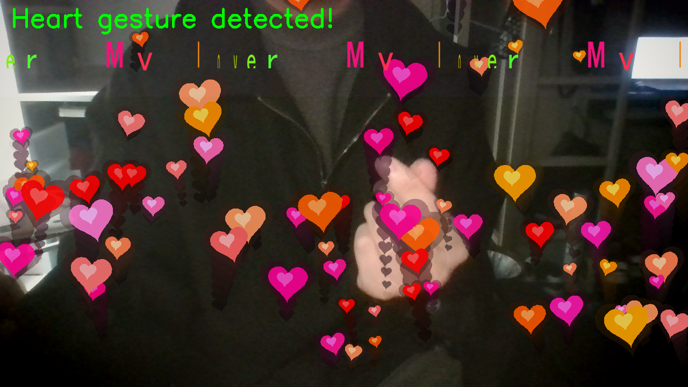
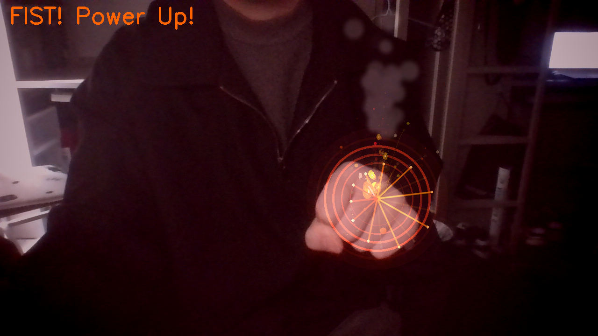

# Beating Heart 手势特效相机

基于 MediaPipe Hands 关键点检测 + 轻量神经网络分类器的实时手势识别应用，支持三种手势触发不同视觉特效。

---

## 效果展示

### 单手比心 — 浮动爱心 + 滚动文字

检测到单手比心手势（拇指与食指交叉形成心形）后，屏幕底部持续冒出跳动的彩色爱心粒子，顶部 1/4 区域滚动播放 3D 旋转文字。



### 拳头 — 格斗火焰气场

检测到握拳手势后，手掌中心喷射多层火焰粒子（亮黄→暗红渐变），伴随火星飞溅、灰色烟雾上飘、红色气场光环脉冲，以及从手掌向外辐射的能量线条。



### 双手比心 — 全屏红色心跳

两只手同时比心时，画面叠加径向红色渐变，中央出现带白色轮廓描边和条纹高光的大爱心，以弹性缓动函数驱动"砰"的跳动感，四周漂浮光芒粒子。

> 提示：运行时按 `s` 可随时截图保存到 `screenshots/` 目录

---

## 技术实现

### 手部关键点检测

使用 **MediaPipe Hands**（v0.10.14）从摄像头画面中提取每只手的 21 个三维关键点（x, y, z），支持同时检测双手。

### 手势分类

| 方式 | 说明 |
|------|------|
| **TFLite 神经网络** | 将 42 个关键点（双手）归一化为 126 维向量，输入三层全连接网络（128→64→3），输出 `heart` / `double_heart` / `fist` 三类别 |
| **规则回退** | 模型文件不存在时自动启用，基于拇指-食指距离、手指弯曲角度等几何阈值判断 |

归一化方式：以手腕为原点居中，除以手掌尺寸（手腕到中指 MCP 距离），消除位置和尺度差异。

### 视觉特效

| 效果 | 实现方式 |
|------|----------|
| 爱心粒子 | 参数方程 `x=16sin³(t), y=13cos(t)-5cos(2t)-2cos(3t)-cos(4t)` 生成形状，粒子层运动模糊残影 |
| 弹性跳动 | `sqrt(sin)` 快速膨胀 + `sin²` 缓慢恢复的缓动函数 |
| 火焰粒子 | 多层椭圆叠加（外层暗→主火焰→内核亮点→白色中心），亮黄到暗红渐变 |
| 烟雾 | 火焰消亡位置生成灰色半透明圆，高斯模糊后上飘扩散 |
| 火星飞溅 | 抛物线轨迹 + 重力加速度 + 短拖尾线 |
| 滚动文字 | PIL 渲染中文字符，逐字符 3D 旋转（cos 缩放）+ 彩虹色相循环 |
| 动态背景 | 手势激活时色调偏移（拳头暗红/比心暖色）+ 四角暗角渐变 |

---

## 环境依赖

- Python 3.12
- 摄像头

### 主程序依赖

| 包 | 版本 | 用途 |
|----|------|------|
| mediapipe | 0.10.14 | 手部关键点检测 |
| opencv-python | 4.13+ | 摄像头捕获、画面绘制 |
| pillow | - | 中文文字渲染 |
| numpy | - | 数值计算 |
| ai-edge-litert | 2.1+ | 加载 TFLite 模型推理 |

### 训练环境额外依赖（可选）

| 包 | 版本 | 用途 |
|----|------|------|
| tensorflow-cpu | 2.21+ | 模型训练与导出 |

> 由于 mediapipe（protobuf<5）和 tensorflow（protobuf>=7）存在版本冲突，训练需要独立虚拟环境。

---

## 快速开始

### 1. 克隆仓库

```bash
git clone <仓库地址>
cd opencoding
```

### 2. 创建虚拟环境并安装依赖

```bash
cd beating_heart
python -m venv .venv
# Windows
.venv\Scripts\pip install -r requirements.txt -i https://pypi.tuna.tsinghua.edu.cn/simple
# macOS / Linux
# pip install -r requirements.txt
```

### 3. 运行

```bash
# Windows
.venv\Scripts\python.exe beating_heart.py
# macOS / Linux
# python beating_heart.py
```

无模型文件时自动使用规则回退模式，可直接体验手势检测。

### 4. 操作说明

| 按键 | 功能 |
|------|------|
| `s` | 截图保存到 `screenshots/` |
| `q` / `ESC` | 退出程序 |

---

## 训练自定义模型

如需提升识别精度，可用自己的数据训练分类器。

### 第一步：采集数据

```bash
# Windows
.venv\Scripts\python.exe collect_data.py
# macOS / Linux
# python collect_data.py
```

| 按键 | 切换到类别 |
|------|-----------|
| `h` | 单手比心（需一只手） |
| `d` | 双手比心（需两只手） |
| `f` | 拳头（需一只手） |
| `空格` | 录制当前帧 |
| `q` | 退出 |

每个类别建议采集 **50 个以上**样本。数据保存在 `gesture_data/{类别}/` 目录下，格式为 JSON。

### 第二步：训练模型

```bash
# 创建训练专用虚拟环境（mediapipe 与 tensorflow 存在 protobuf 版本冲突，需独立环境）
python -m venv .venv_train
# Windows
.venv_train\Scripts\pip install tensorflow-cpu numpy -i https://pypi.tuna.tsinghua.edu.cn/simple
.venv_train\Scripts\python.exe train_model.py
# macOS / Linux
# .venv_train/bin/pip install tensorflow-cpu numpy
# .venv_train/bin/python train_model.py
```

训练完成后生成 `gesture_classifier.tflite`，主程序启动时自动加载。

### 第三步：使用模型运行

```bash
# Windows
.venv\Scripts\python.exe beating_heart.py
# macOS / Linux
# python beating_heart.py
```

终端会打印 `[模型] 加载成功` 表示模型已生效。

---

## 项目结构

```
opencoding/
├── README.md                     # 项目说明（本文件）
├── .gitignore
└── beating_heart/
    ├── beating_heart.py          # 主程序（检测 + 特效）
    ├── collect_data.py           # 训练数据采集脚本
    ├── train_model.py            # 模型训练与 TFLite 导出
    ├── requirements.txt          # 主程序依赖清单
    ├── gesture_classifier.tflite # 训练好的模型文件
    └── screenshots/              # 运行时截图
```

> `gesture_data/`（训练数据）和虚拟环境目录已加入 `.gitignore`，不会提交到仓库。
